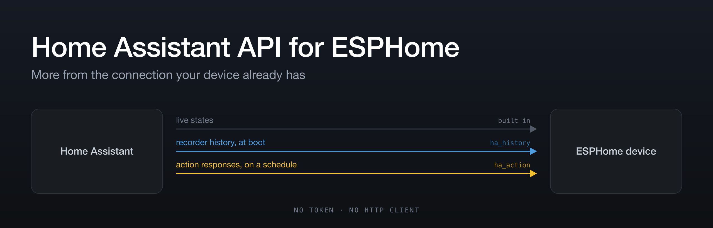

# esphome-ha-api

Two ESPHome components that get more out of the Home Assistant connection your device
already has.

Home Assistant holds an encrypted native-API connection to every adopted ESPHome device, and
that connection can carry far more than live state pushes. These components use it for the two
things people usually reach for a Home Assistant automation or an HTTP client to do:

| | |
|---|---|
| **[`ha_action`](#ha_action)** | Call a Home Assistant action on a schedule and bind fields of its response to ESPHome entities — a weather forecast, a tariff curve, anything an integration will return. |
| **[`ha_history`](#ha_history)** | Sensors that arrive with their recent history already loaded, backfilled from recorder statistics at boot, so a time-series graph renders immediately. |

```yaml
external_components:
  - source: github://eman/esphome-ha-api
```

No `components:` key. The two share their request transport, and a list naming only one of them
stops the other from importing; omitting it is correct here. If you would rather be explicit,
name both: `components: [ha_action, ha_history]`.

Neither needs a credential or an HTTP client. Both ride the connection Home Assistant already
holds to the device.

---

# `ha_action`

<a name="ha_action"></a>

Say you want tomorrow's forecast on a panel. Home Assistant has it — `weather.get_forecasts`
returns it — but ESPHome's built-in `homeassistant.action` is an *automation action*: you fire
it yourself, it stores nothing, and the `JsonDocument` it hands your lambda dies when the lambda
returns. So the usual workaround is to build template sensors in Home Assistant that flatten the
forecast into attributes, and subscribe to those. That puts device presentation logic in the
hub, and you do it again for the next dashboard.

`ha_action` makes the round trip declarative:

```yaml
ha_action:
  - id: forecast
    action: weather.get_forecasts
    data:
      entity_id: weather.home
      type: hourly
    update_interval: 30min

sensor:
  - platform: ha_action
    ha_action_id: forecast
    name: Temperature in 3 hours
    path: '["weather.home"].forecast[3].temperature'
    device_class: temperature
    unit_of_measurement: °C
```

That is the whole thing: an entity on the device, fed from an action response, with nothing
added to Home Assistant.

## Paths

**Home Assistant keys action responses by entity id, and entity ids contain dots.**
`weather.get_forecasts` returns `{"weather.home": {"forecast": [...]}}`, so the first segment of
the commonest response shape in the domain is a key that a plain dotted path cannot express.
Hence the bracket form:

| | |
|---|---|
| `forecast[0].temperature` | plain keys and array indices |
| `["weather.home"].forecast[0]` | a quoted key, for anything containing dots, spaces or brackets |
| `forecast[-1].temperature` | negative indices count from the end |

Paths are compiled by `esphome config`, so a malformed one is a config error with a caret under
the offending character rather than a device that silently publishes nothing:

```
expected an integer index or a quoted key, like [0], [-1] or ["sensor.x"]
    forecast[0x].temperature
             ^
```

A path is relative to the action's **own response** — the `{"response": ...}` envelope Home
Assistant wraps it in is already unwrapped for you.

Resolving to nothing is not an error. A forecast is twelve entries long today and ten tomorrow,
so `sensor` publishes `NaN`, `text_sensor` publishes `""`, and `binary_sensor` keeps its last
state. A JSON `null` counts as nothing; a genuine `0` does not, because 0.0 mm of precipitation
is data.

## Server-side templates

`response_template:` is rendered by **Home Assistant, before the reply crosses the wire**, so
you can reshape a large response into exactly what the device needs:

```yaml
ha_action:
  - id: cost
    action: recorder.get_statistics
    data:
      start_time: !lambda 'return today_midnight_iso();'
      statistic_ids: sensor.energy_cost
      period: day
      types: change
    response_template: >-
      {{ response.statistics.get('sensor.energy_cost', [])
         | map(attribute='change') | select('is_number') | sum | round(4) }}
```

The device receives one number instead of a list of rows. This matters more than it looks: the
API frame limit is 32 KiB and **exceeding it drops the connection**, so narrowing server-side is
how large responses stay usable at all.

`template:` goes further — arbitrary Jinja with no action of your own behind it:

```yaml
ha_action:
  - id: house
    template: >-
      {{ {'people_home': states.person | selectattr('state', 'eq', 'home') | list | count,
          'sunset': as_timestamp(state_attr('sun.sun', 'next_setting')) | int} | tojson }}
    update_interval: 5min

sensor:
  - platform: ha_action
    ha_action_id: house
    name: People home
    path: people_home
```

Home Assistant renders that with `states()`, `state_attr()`, `now()` and the rest of its
template environment in scope. It is the direct replacement for a template sensor built solely
to feed a panel.

<details>
<summary>Why <code>template:</code> needs a carrier action</summary>

Home Assistant only renders a `response_template` inside the branch that handles actions
returning a response, and there is no generic `homeassistant.*` action that returns one. So
something has to carry the template. `ha_action` uses `recorder.get_statistics` with a
`statistic_ids` that matches nothing and a `start_time` fixed in 2099: `recorder` ships in
`default_config`, the query does no real database work and returns `{"statistics": {}}`, and
fixing the date means no clock is involved — which is why `template:` needs no `time:`
component. Override it with `carrier_action:` and `carrier_data:` if you have a cheaper one.

A rendered template is `literal_eval`'d by Home Assistant before encoding, so `[1, 2]` arrives
as a real array. `literal_eval` does not know JSON's `true`/`false`/`null` though, so anything
ending in `| tojson` over a boolean comes back as a *string* holding JSON. `ha_action` parses
that case for you; you should not have to care.
</details>

## Passing something that isn't a string

Action data crosses the wire as strings, and Home Assistant's schemas usually coerce them —
`cv.ensure_list` turns `"sensor.a"` into `["sensor.a"]`, so single values need no wrapper. Two
names do not work that way:

```yaml
data:
  statistic_ids: sensor.a,sensor.b      # WRONG - one id named "sensor.a,sensor.b"
data_template:
  statistic_ids: '{{ ["sensor.a", "sensor.b"] }}'   # a real two-element list
```

`data_template` values are rendered by Home Assistant and then literal-evaluated, so lists,
numbers and booleans survive. It is also where server-side lookups belong:

```yaml
data_template:
  config_entry: "{{ config_entry_id('sensor.my_integration_thing') }}"
```

## Configuration

### `ha_action:`

A list of requests.

| Key | Default | |
|---|---|---|
| `action` | | the action to call, e.g. `weather.get_forecasts`. Exclusive with `template` |
| `template` | | server-side Jinja, with a carrier action supplied for you. Exclusive with `action` |
| `data` | `{}` | action data. Values may be lambdas. Home Assistant's schemas coerce single values to lists, so no list wrapper is needed |
| `data_template` | `{}` | data whose values Home Assistant renders as Jinja and then literal-evals — the only way to pass something that is not a string (see below) |
| `variables` | `{}` | variables in scope for `data_template` |
| `response_template` | | Jinja that reshapes the response, rendered by Home Assistant |
| `update_interval` | once per API connection | a duration, or `never` for a request that runs only when asked — from a `button`, or another request's `on_response` |
| `retry_interval` | `30s` | first retry after a failure; doubles to a 10 min cap |
| `timeout` | `20s` | |
| `retain` | `false` | keep the parsed response between refreshes, for lambdas that walk a whole array. Uses PSRAM where available |
| `on_response` | | `JsonVariantConst response` |
| `on_error` | | `std::string error` — Home Assistant reached the action and it failed |

### Entity platforms

All three take `ha_action_id` and `path`, plus everything their platform normally accepts.

| Platform | |
|---|---|
| `sensor` | the value as a number; `NaN` when absent |
| `text_sensor` | strings as-is; anything else serialised, so pointing one at a number or an object works |
| `binary_sensor` | the value as a boolean, or numeric against `threshold:` when given |
| `button` | re-runs the request |

## Reading a retained response

```cpp
if (id(forecast)->has_response()) {
  for (JsonObjectConst e : id(forecast)->response()["weather.home"]["forecast"].as<JsonArrayConst>())
    ...
}
```

Needs `retain: true`; without it the parsed document lives only for the duration of the reply.

---

# `ha_history`

<a name="ha_history"></a>

<p align="center">
  
</p>

ESPHome's built-in `homeassistant` sensor gives a device live values pushed over the native
API — but only from the moment it connects. A panel drawing a time-series graph boots to an
empty chart and spends hours filling it in.

A `ha_history` sensor behaves **exactly like a `homeassistant` sensor** — same `entity_id`,
same live pushes, same `NaN` for `unavailable` — and additionally keeps one value per bucket
(5 minutes or an hour) over a window (a rolling duration, or today so far). On startup it asks
Home Assistant for the recent past and hands your renderer a filled buffer within a few
hundred milliseconds of connecting. From then on the live pushes extend the same buffer, so
there is no seam between "history" and "now".

```yaml
time:
  - platform: homeassistant

sensor:
  - platform: ha_history
    id: pv
    entity_id: sensor.pv_power
    history:
      window: today      # or 24h, 3d, ...
      bucket: 5min       # or hour
      statistic: mean    # mean | min | max | state | change
    on_history_loaded:
      - lambda: |-
          ESP_LOGI("pv", "%u points, %.2f..%.2f",
                   (unsigned) id(pv).history_size(), id(pv).history_min(), id(pv).history_max());
    on_history_update:   # a bucket closed, or the day rolled over
      - script.execute: redraw
```

## How it works

History comes from Home Assistant's **recorder statistics** — the same 5-minute and hourly
aggregates that draw the graphs in Home Assistant's own UI. The hub sends the
`recorder.get_statistics` action over the native API with a `response_template`, and Home
Assistant renders that Jinja *server-side* into a compact list of `[bucket index, value]` pairs
before it crosses the wire: a full day at 5-minute resolution is ~3–5 KB rather than the 26 KB
of raw statistics rows.

Live pushes are then folded into the current bucket the way Home Assistant computes its own
statistics: the `mean` is time-weighted, the value in force at the bucket boundary is carried
in, and `unavailable` holds the previous value rather than poisoning the bucket. Matching that
arithmetic is what makes backfilled and live buckets indistinguishable.

Seven minutes after the first load, one narrow follow-up request repairs the bucket that was in
progress at boot — the only one that can't match, because the device saw only part of it and
Home Assistant's newest row lags the clock by up to five minutes.

## Requirements

- Entities with a **`state_class`** (`measurement`, `total` or `total_increasing`). That is
  what gives an entity statistics. Text sensors, binary sensors and plain sensors have none,
  and their raw history is far too large to pull onto a microcontroller (one power sensor
  measured 577 KB for a day; its statistics were 26 KB).
- `time: platform: homeassistant` (or another time source with the same timezone as HA), so
  `today` and the bucket boundaries agree with Home Assistant's.

## Configuration

### `ha_history:` (hub, optional)

Sets defaults for every sensor. Auto-loaded by the platform; only write it to change a default.

| Key | Default | |
|---|---|---|
| `window` | `24h` | `today`, or a duration (`24h`, `3d`, …) |
| `bucket` | `5min` | `5min` or `hour` |
| `retry_interval` | `30s` | first retry after a failed request; doubles to a 10 min cap |
| `time_id` | the sole `time:` component | |

### `sensor: platform: ha_history`

Everything the `homeassistant` sensor platform accepts (`entity_id`, `name`, `id`, filters,
`internal` — default `true`, …), plus:

| Key | |
|---|---|
| `history.window` | overrides the hub default |
| `history.bucket` | overrides the hub default |
| `history.statistic` | `mean` (default), `min`, `max`, `state`, `change`. `mean/min/max` for `state_class: measurement`; `change` for `total_increasing` meters (a reset counts from zero, as HA does). |
| `on_history_loaded` | backfill merged into the buffer (fires per successful load) |
| `on_history_update` | a live bucket closed, or the day rolled over |

`attribute:` is rejected — statistics exist only for the entity's state.

### `button: platform: ha_history`

Re-runs the backfill.

### Limits

The reply must fit one API frame (32 KiB), and **exceeding it drops the API connection**. So the
size is bounded at config time (`esphome config` rejects the offending sensor) and guarded at
runtime:

- `window / bucket ≤ 1000 points` with PSRAM, `≤ 500` without. 24 h @ 5 min = 288; 7 d @ hour = 168.
- `bucket: 5min` needs `window ≤ 10 days` — Home Assistant purges 5-minute statistics after that.

## Reading the buffer

```cpp
id(pv).history_loaded()                       // backfill has landed
id(pv).history_size()                         // points held
id(pv).history_copy(starts, values, cap)      // parallel arrays, oldest first; returns count
id(pv).history_min(), id(pv).history_max()
id(pv).bucket_seconds()                       // 300 or 3600
id(pv).window_start(), id(pv).window_seconds()  // for the x axis; epoch UTC
id(pv).history()                              // const SeriesBuffer & (at(i).start / .value)
```

Gaps are represented by absence — a bucket Home Assistant has no row for is simply not in the
buffer, so map x by `start`, not by index. Bucket starts are UTC-epoch aligned, as HA's are.

### LVGL

`components/ha_history/lvgl_helpers.h` compiles when the config has an `lvgl:` block, and offers:

```cpp
using namespace esphome::ha_history;
// Filled-area sparkline into a transparent (ARGB8888) canvas; zero-based axis by default.
lvgl::sparkline(id(my_canvas), id(pv), 0xF2C230);
// Points for a `line` widget.
static lv_point_precise_t pts[320];
size_t n = lvgl::line_points(id(pv), pts, 320, width, height);
lv_line_set_points(id(my_line), pts, n);
```

See `examples/lvgl_sparkline.yaml`. Call both from `on_history_loaded` and `on_history_update`.
ESPHome has no LVGL `chart` widget (as of 2026.8), which is why these exist.

## Behaviour worth knowing

- **Backfilled buckets win** where a live bucket already exists. HA's statistics come from the
  full sample stream; the device's live bucket from whatever it happened to see.
- **Two Home Assistant instances** connected to one device both push states, so live samples
  arrive twice — harmless to a time-weighted mean. History is requested from one of them.
- **Units.** Statistics come back in the entity's *stored* unit; live pushes in its *display*
  unit. If you have changed an entity's display unit in Home Assistant, the two differ and the
  join shows a step. There is no unit metadata in the reply to detect this automatically.
- **After an API outage** longer than one bucket the history is loaded again; gaps are filled
  the same way the boot backfill fills them.

---

# Requirements

Shared by both components:

- **Home Assistant 2025.x or newer**, for action responses in the ESPHome integration. Older
  versions silently never reply.
- The device adopted in the ESPHome integration, with **"Allow the device to perform Home
  Assistant actions"** enabled in the device's options. It defaults to off. When it is off,
  Home Assistant sends *nothing back* — no error — so the only symptom is a timeout; both
  components name this option in their warning after two of them.
- **ESP32 family.** The ESP8266's 8 KiB API frame and 40 KB heap are not enough.

# How requests are made

Both components share `components/ha_action/action_client.h`. It exists because ESPHome's
built-in `homeassistant.action` has four properties that are fine for a button press and not
for scheduled, unattended use:

- It registers its response callback **before** sending, and the server-side send returns
  `void`. Home Assistant subscribes to actions shortly *after* authenticating, so a call fired
  at boot is dropped — and its callback is already registered. `ActionClient` sends to one
  client through the per-connection call, which returns `false` in exactly that window, and
  registers nothing until a send is accepted.
- Registered callbacks are erased only by a matching reply. There is no timeout and no removal
  API, so an unanswered call leaks its callback forever. `ActionClient` holds its own deadline
  and a `weak_ptr`, so late replies are ignored and absent ones are bounded.
- The built-in's `call_id` counter is a function-local static **per template instantiation**, so
  two `homeassistant.action` blocks both start at 1 and can cross-deliver responses. Here one
  counter is shared by every client in the binary, seeded far from the built-in's.
- Exceeding the 32 KiB frame **drops the connection**, after which Home Assistant reconnects and
  a scheduled caller would ask again — a flap loop. A connection lost within two seconds of a
  send is treated as "reply too large" and backed off to the ten-minute cap.

Failures are loud and bounded: three unanswered requests on one connection and the component
stops until the API reconnects or a refresh button is pressed.

# Development

`components/ha_history/series.h` (buffer and bucket arithmetic) and
`components/ha_action/path.h` (the path walker) are plain C++17 with no ESPHome dependency, and
the path grammar is plain Python. `tests/` runs all three on the host:

```sh
make -C tests test
```

CI compiles the examples for `esp32` and `esp32p4` on every push.

# License

MIT.
